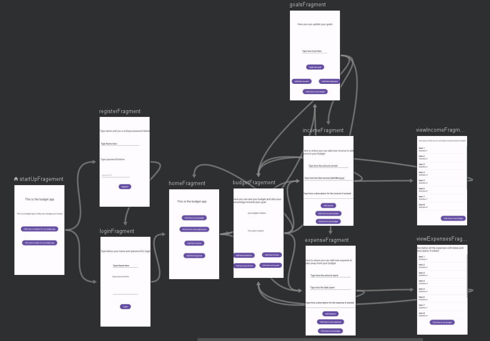

Adam Buchan 2107616
Budget app
a app that allow the user to manage their budget
this a budget app developed in android studio that has the function of registering and logging using the users inputted data in a user and then letting them add income and expenses with the amount date and description if needed also using the users data and also set thier goal also using the users inputted data for their budget it also tell them thier budget and how close they are to thier budget

<h1>Details of app design:</h1>
<h1>Start page</h1>

<ul>
  <li>Textview 1: display the title</li>
  <li>Button 1:takes you to the Register page</li>
  <li>Button 2:takes you to the login page</li>
</ul>
this is the main start up page of my app and all it does is tell the user what kind of app this is and allow the user to navigate to the register page or the login page using the buttons.
<h1>Register page</h1>

<ul>
  <li>text view 1 :displayes the title</li>
  <li>text view 2: tells the user what to do on screem</li>
  <li>Input 1 :lets user write thier username</li>
  <li>Text view 3:tells user to type password below</li>
  <li>Input 2: let user type thier password</li>
  <li>button 1: button to click to register account</li>
</ul>
this is the regsiter page that allow the user to make an acount using a user name and an password using the input widgets with some user error handling added in and it make a new object in my firebase databse for the user and with all the object it will need and once you click the regsiter button it takes you to the login page to login there.
<h1>Login page</h1>

<ul>
  <li>Textview 1: tells user what to do on the page</li>
  <li>Input 1: lets user type username</li>
  <li>textview 2:tells user to type password down below</li>
  <li>input 2: lets user type password</li>
  <li>Button 1:button to clic to login</li>
</ul>
this is the login page that allow you to login by searching through the databse,using the inputted username and password from the user from the input widgets, to see if a user with the same username and password exist and if it does naviage to the home page and if it doenst it tells the user it can not log in as the ethier the user doesnt exist or the password is wrong.
<h1>Home page</h1>

<ur>
  <li>Textview 1: displays the title of the screen</li>
  <li>Button 1: click to go the budget page</li>
  <li>button 2: click to go the goals page</li>
  <li>button 3: click to go to income page</li>
  <li>button 4: clcik to go to expenses page</li>
</ur>
this is the home page that mainly is here as a way to naviagte to all the main pages such income and expenses page and the budget and goals pages.
<h1>Budget page</h1>

<ul>
  <li>Textview 1: display the page title</li>
  <li>TextView 2: tells user budget will be below</li>
  <li>Textview 3: the outputted budget</li>
  <li>Textview 4: tells user gaols will be below</li>
  <li>Textview 5: displays the goals and percenatage towards it</li>
  <li>Button 1: button to click to go to expenses< page/li>
  <li>Button 2:Button to click to go to income page</li>
  <li>Button 3: button to click to go to home page</li>
  <li>Button 4: button to click to go to goals page</li>
</ul>
This is the budget page that allow the user to see thier budget and also to see thier goal taken from the firebase database and output them to a text view widget and the percentage to reaching it and also allow the user to navigate to the income and expenses pages and the goals pages.
<h1>goals page</h1>

<ul>
  <li>Textview 1: tells the user what the page can do</li>
  <li>input 1:lets the user input a new goal</li>
  <li>Button 1: button to click to make inputted value new goao</li>
  <li>button 2:button to click to go to income page</li>
  <li>button 3: button to click to go to exepenses pages</li>
  <li>button 4: button to click to go to budget page</li>
</ul>
this is the goals page that allow the user to update thier goal by using a input box widget and posting the new goal to the firebase daytabse and this also allow naviagion to the income and expenses pages and back to the budget page
<h1>income/exepenses page</h1>

<ul>
  <li>Text view 1: tells users what the shouls do on page</li>
  <li>input 1: lets user add an amount</li>
  <li>Input 2: lets user input a date</li>
  <li>Input 3: lets user input a description if needed</li>
  <li>Button 1: click to add income/expenses</li>
  <li>Button 2:clcik to see income/expenses</li>
  <li>Button 3: click to go to budget page</li>
</ul>
this is the income and expenses pages and it allow the user to input the amount of income/expenses the date gotten and a description then post the new income/exepenses to the firebase databse when the button is clicked and the page also get the value at the time of budget and then adds the new income or takes away the expenses from it and then post that to the databse along with the income/expenses and the page also allow the user to naviagte to the income/expenses view page and back to the budget page.
<h1>income/epenses view page</h1>

<ul>
  <li>Text view1: tells the user that all income/expenes are displayed below</li>
  <li>List view 1: show all the income/exepense with the amount, date and description if added</li>
  <li>Button 1:click to go to budget page</li>
</ul>
these are the income and expenses pages that take all the added income or expenses from the database and put them into a list view so the user can see and allow naviagion to the budget page
<h1>Navigation</h1>

this is the naviagtion screenshot of all my fragments
<h1>Reflective statement</h1>
In the making of my budget app I got a more indepth view into some of the knowledge like  VOLLEY as i was able to know about the use of POST and PATCH using volley to write to the database and also to upadate the databse and i feel like a got a better grasp on the passing of data between fragments using arguments and bundles after making this app and during the course of the project i did use generative AI to help with this project which i will have the links for the chats in a file called <b>generativeAI</b> and the way i used this was to ask about version of thing i didnt know about like the POST and PATCH for VOLLEY and also error code that i got or things that heppened when i was running the debugger like jumping methods or lines of code ect but i also had problems with this as the code generated sometimes woulnt add a varaible so the code wouldnt work as inteded and also some times i was only give the code for one fragment so it didnt know if the bundle was really being passed to this fragment so it just assumed that something was wrong with the IDE or my internet permissions ect. 
something succeful with the project would be able to fully read and write to the firebase database using volley since i hade more then one GET, POST and PATCH so im glad that they all work since some times i had to use a get to post something like get a key from a jsonobject.
